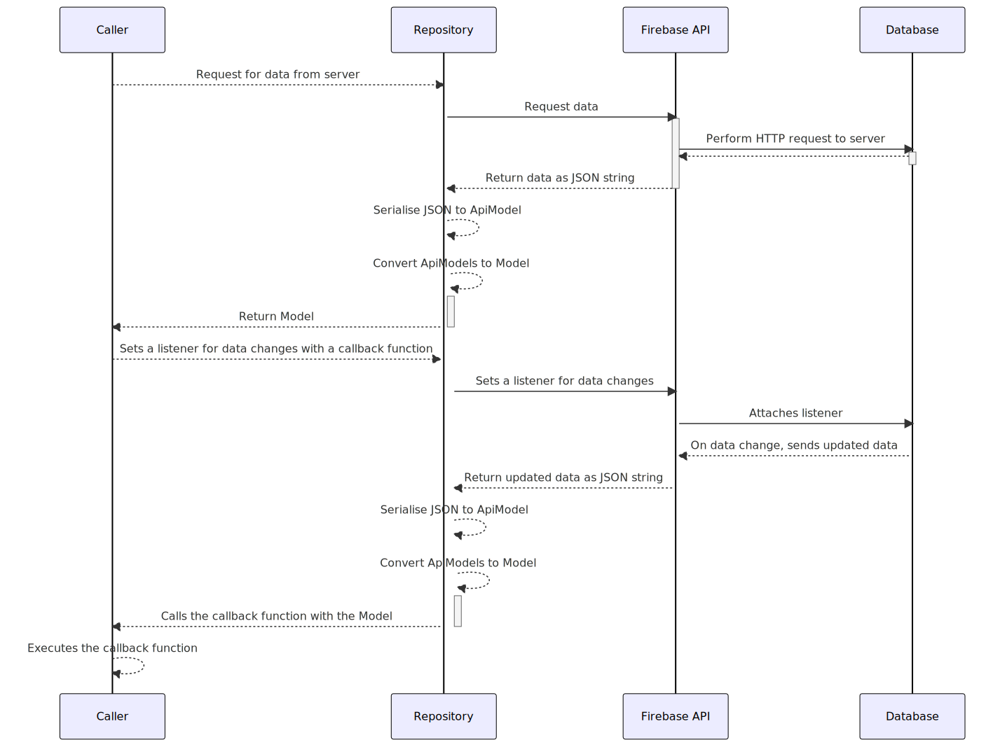
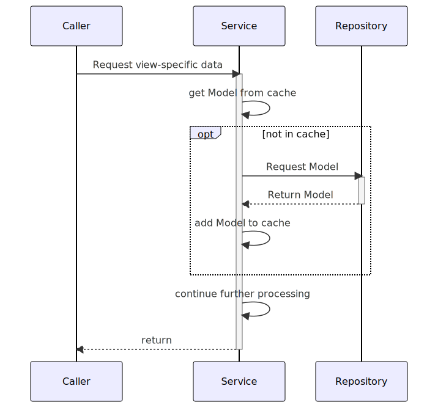

# Overview

The sotravel application is designed to aid the startup
[sotravel.me](https://sotravel.me) manage their trips.

## Context

Sotravel.me organises group adventure travel for young adults. The aim of the
startup is to allow young adults to go on adventurous trips such as skiing or
diving and make friends in the process. The company has a ski trip slated for
April 2023. The goal of the application is to allow trip hosts to publish events
within the trip and invite participants to these within-trip events, track the
physical location of participants, and allow trip hosts and participants to
communicate with each other.

# Features and Specifications

## Host features

-   Log in/Register with Telegram
-   View all traveller locations on a map (in real-time)

## Traveller features

### General

-   Log in/register with Telegram
-   Switch between active trips

### Events

-   Allow travelers to create events
-   Allow travelers to RSVP to events
-   Create and send out event to people nearby, friends only or selected people

### Profile

-   Allow travelers to update their profile with social information

### Friends

-   Allow travelers to view friends on the trip and message them on Telegram

### Map

-   Depending on where the user is at, load the correct map. Mountain map vs
    street map.
-   View all nearby traveller locations on a map (in real-time)

### In-app instant messaging

-   Provides an easy means of communication between group members
-   Helps to ensure a degree of privacy as users do not need to share more
    personal information like Telegram handle or phone number

# User Manual

Please see [User Manual](./user-manual.pdf)

<div class="page"/>

# Designs

We will break down the applications design into 2 parts, the backend and
frontend. For ease of understanding, the backend specifically refers to the part
of the codebase that does not directly deal with the views. This can be thought
of as the components that do not directly deal with the views. The frontend is
the set of components that do deal with the views (and presentation more
broadly).

## Overall architecture


_See a higher resolution version of the image [here](./diagrams/final-report/overall-architecture.svg)_

The overall architecture can be seen above. We can categorise the system into
the following components

-   Repository and API models
-   Models
-   Service and ViewModels
-   Views

The respositories handle retrieving/updating information from the data store. In
our case, the repositories communicate with Firebase as well as a backend REST
API written in NodeJS.

The Models are the internal representation of key information within the trip.
The API models (which are representations of data from the data source) are
converted into models which are used as the source of truth for the Service
layer and the front end.

The Service layer consumes the models and publishes ViewModels which contain
view-specific information. The ViewModels contain only the information required
for a specific View. Thus, they prevent irrelevant information from being leaked
to the View.

The Views consume the ViewModels and set up an observer relationship with them.
This allows the views to be updated when a ViewModel is updated, without
repeatedly setting the values of UI elements such as text boxes. In effect, this
allows for a 1-way binding relationship.

### Flow of data

The backend of the application adopts a 3 layer architecture approach. A generic
model of how the backend obtains data is shown below


The high level idea is as follows:

-   A repository for each data model exists to retrieve information from a data
    access layer. The repository conforms to an interface so that it can easily
    be swapped out later in favour of a repository that pulls information from a
    different data source.

    -   The diagram below shows how a repository gets data from a REST API
        
    -   The way a repository gets data from a (Firebase) database is similar, but also attaches a listener so as to get notified of any data changes:
        

-   A service exists for that data model. It contains a dependency-injected
    repository. The service converts the model into a view model which the view
    can consume
-   A view contains a reference to a service which generates a view model. The
    view observes the viewmodel to reflect changes to the data.
    

The 3 layers put together show how data is called from each layer


The `Repositories` for each model conform to an interface and are dependency
injected into each `Service`. Dependency injection is done through property
wrappers. This allows for the following benefits:

-   Repository implementation can easily be changed. Today we suffix many of the
    concrete implementations with "Node" since our data source is essentially a
    Node API, but in the future the data source may change
-   Dependencies are not injected through constructors, preventing a "carrying"
    effect where each layer needs to pass dependencies down
-   Testability is greatly increased as dependencies can easily be replaced with
    stubs/mocks. We already use such stubs/mocks of repositories such as the
    `UserRepository` to provide mock data during testing.

### Frontend

The frontend is relatively straightforward, following an MVVM architecture. A
`Service` is injected into each `View`, and the `View` observes a `ViewModel`
returned by a `Service`. When the service is requested to provide new
information, it obtains the information required and notifies the ViewModels
observing it that there has been a change. The ViewModels then update
themselves and these changes propagate to the View since the View is observing
the ViewModel. Greater detail on how the Observers are set up can be found below
under the section
[Service-ViewModel observer relationship](#service-viewmodel-observer-relationship)

## Models

The application has 5 key models it makes use of. They are defined below.


These models are enough to ensure that all the key data for the application can
be derived.

## Repositories

The application makes use of 5 repositories. These repositories primarily
perform CRUD operations on their respective models, and persist those changes to
their respective persistent storage services (Firebase or REST API.)

All of them except `MapRepository` produce the models seen above.
`MapRepository` listens for user coordinates and produces use of built-in
datatype `CLLocation` instead. As a result, to avoid bloat, an encapsulating
model does not exist for the information produced by the `MapRepository`.

### Pull Repositories

`UserRepository`, `TripRepository` and `EventRepository` pull
information from a server when requested. In other words, they operate on a
polling/pull basis.


### Push Repositories

On the other hand, `ChatRepository` and `MapRepository`
operate on a push basis, with information pushed to them from the real-time data
store. To register changes in the data, they take in delegates to update their
respective callers when there is a change in data.

These delegates are termed as `completion` handlers, and are passed in to the
respective repository functions that listen for changes in data on the
database's side.


### Data conversion

The repositories work in terms of `APIModels`, which are Swift classes that
represent the JSON response returned by the server. However, the application
itself fundamentally works in terms of `Model`s which mirror the data consumed
by the application. Thus, the repositories needed essentially perform the
following tasks:

1. Retrieve relevant data as JSON string from server
1. Decode JSON string into API Model type
1. Handle JSON decoding errors if any
1. Convert API Model Type into Model type
1. Return Model to caller

In particular, steps 2-5 were repetitive steps that every respository method
needed to implement. Writing the same code to perform these tasks resulted in a
lot of code reuse. Thus a generic `DecoderHelper` was created that made use of
Swift's [associated
types](https://docs.swift.org/swift-book/documentation/the-swift-programming-language/generics/#Associated-Types)
and type inference to convert `APIModels` into `Models`

We linked the `APIModels` and `Models` through protocols
`ConvertableFromApiModel` and `ApiModel`. The `ConvertableFromApiModel` protocol
specified a constructor that would allow the `Model` to be initialised from an
`ApiModel`.

The relationship between these protocols and classes can be seen below:


One major benefit of using associated types here is that it allows the `Model`'s
constructor to specify which specific sub-type of `ApiModel` it is able to
convert. This improves type safety within the application and prevents issues
such as a User model trying to be initialised from an Event API model.

The code snippet that handles this conversion can be found in the file
[DecoderHelper.swift](https://github.com/DrWala/sotravel-ios-app/blob/main/Sotravel/Sotravel/NodeRepository/DecoderHelper.swift).
It has been replicated below as well:

```swift
static func decodeToClass<ReturnType: ConvertableFromApiModel>(data: String, location: String = #function, line: Int = #line) throws -> ReturnType {
        do {
            let responseModel = try JSONDecoder().decode(ReturnType.TypeToConvertFrom.self, from: Data(data.utf8))
            return try ReturnType(apiModel: responseModel)
        } catch is DecodingError {
            let modelName = String(describing: ReturnType.self)
            let prefix = constructErrorPrefix(location: location, line: line)
            throw SotravelError.message(
                "\(prefix) Unable to decode json at \(location) to \(modelName). The JSON string is \(data)")
        } catch {
            throw error
        }
    }
```

A similar snippet exists to decode into lists instead of singular types as well.

## Services

There are 7 main services used in the application:

-   UserService
-   EventService
-   TripService
-   FriendService
-   ChatService
-   MapService
-   LocationManagerService

Most services interact with their respective repositories for data storage
purposes (e.g `UserService` interacts with `UserRepository`). However, there are
2 main excpetions:

-   `LocationManagerService` interacts with the built-in `CLLocationManager`
    which interfaces with the device's GPS module
-   For better coherence, `FriendService` interacts primarily with
    `TripRepository` to return the users who are going on a specific trip

Each of the services can be seen below, alongside the Repositories they hold a
reference to

_See a higher resolution version of this image
[here](./diagrams/final-report/services-overview.svg)_

Of the 6 services, `UserService`, `EventService`, `TripService` and
`FriendService` are observed by the `ViewModels` they serve. Since these
services create the `ViewModel`s, they register the `ViewModel`s as observers
which are notified when the underlying `Model`(s) change. We explain this in
detail in the section
[Service-ViewModel observer
relationship](#service-viewmodel-observer-relationship)

In addition, the same 4 Services also work with models that may regularly need
to be retrieved but that information does not necessarily need to be up to date.
To reduce the frequency of calls to the backend, they subclass the
`BaseCacheService` class and ensure that data retrieval is attempted from a
local cache first. This has improved the speed of the application, resulting in
a better UX. We explain this in detail in the [caching](#caching) section.

### Service-ViewModel observer relationship

To decouple the `Service` from the `ViewModel`s it serves, an observer pattern
was set up so that the `ViewModel` can observe the `Service` from whom it pulls
data. This ensures that

-   `Services` don't hold direct references to the `ViewModel`s who rely on it,
    decoupling them through the observer abstraction
-   The responsibility of updating the `ViewModel` is passed back to the ViewModel,
    instead of the `Service`

The pattern is set up as shown below:


The observer pattern allows for the `Service` to inform its observers (typically
other `ViewModels`) through the `notifyAll` method that it's relevant data has
changed. Since the `Service` can then call the Observer's `updateFrom` method,
the observers can then perform an update within themselves with the new data
recieved.

Notice that the `Observer` and `Subject` class make use of the [Swift Associated
Types](https://docs.swift.org/swift-book/documentation/the-swift-programming-language/generics/#Associated-Types)
feature to ensure the protocol is kept generic. This means that any Service
implementing the `Subject` protocol can dictate the type of the data being
observed, as well as the type of Observer. This allows for complex observer
relationships to be set up where the type of the data being observed does not
necessarily need to match the class implementing the observer pattern.

The `Service`s which have the Observer protocol implemented are the following:

-   UserService
-   EventService
-   TripService
-   FriendService

The association between these `Service`s and the `ViewModel`s which rely on them
can be seen in the two diagrams below

The first diagram shows which `Service`s implement the Subject protocol:


The next diagram shows which `ViewModel`s implement the Observer protocol:


_Note: Methods have been ommitted for simplicity_

For a sample on how a service implements the Observer protocol, please see
[Structure of User Service and Observer](#structure-of-user-service-and-observer)

#### Updating data

We've provided a diagram showing how the `ViewModel` is registered as an
observer of the service under [flow of data](#flow-of-data). However, when a
model is updated by the service, the observer pattern allows the `ViewModel`s to
be notified of a change without a new `ViewModel` being instantiated. This is
because the observer pattern allows the `Service` to directly notify observing
`ViewModels` that the associated underlying model has changed. We demonstrate
how that interaction works in the diagram below:


### Caching

We've implemented a custom caching layer that allows for data to be cached and
retrieved without a network call. Specifically, we cache the `Model`s associated
with `UserService`, `EventService`, `TripService` and `FriendService`. The
models associated with these services do not change frequently or in real time,
and thus it is acceptable to cache their values. A `reload` function also
exists in each of these services to pull fresh data from the server should it be
required.

A class diagram showing which classes implement the `BaseCacheService` can be
seen below:


In general, the workflow for working the Cache layer is as follows:


One of the key benefits of introducing the cache at the `Service` layer is the
following: Multiple `ViewModel`s rely on the same model, and thus if we cache
the model, we avoid unnecessary network IO to produce those `ViewModel`s

A class was used instead of a protocol because the `BaseCacheService` was set up
as a generic class with default implementations of all the methods within the
class. This allows the the `BaseCacheService` to easily be subclassed and
provide extensive caching functionality to any class that extends from it.

## Live location sharing

The live location sharing is one of the key features of the application. The
goal is to allow the user to update their location and save that to the
database, as well as allow the user to view the live locations of all of their
friends.

### Location Management: Key responsibilities

The location management functionality has three key parts:

1. Getting the user's current location via GPS
1. Persisting the user's location to the real-time database
1. Pulling all the friends' locations onto the map

Part (1) is handled by the `LocationManager` while parts (2) and (3) are handled
by the `MapStorageService` which relies on the `MapRepository`.

The class diagram for how these 3 key classes interact with the `MapView` is
shown below:


### Location Management: Flow of data

The `LocationManager` resolves the user's current location via GPS, while the
`MapStorageService` sends and receives information from the persistent data
store. The delegate pattern is employed here, where the `MapStorageService`
passes a delegate function to the `LocationManager` to call to when the user's
location is updated. This allows the app to easily swap out the desired
behaviour when the user's location changes, decoupling it from the GPS service
itself as well as allowing flexibility on the actions to be taken when the user
is moving around.

The flow of how the user's GPS coordinates are stored in the data storage as
well as how friends' locations are retrieved and updated on the map can be seen
below:


## Sample Interactions

### Structure of User Service and Observer

This section aims to explain how the UserService is structured with respect to
the Observer protocol. The diagram below shows an example of how the observer
pattern is set up within the `UserService`. The associated types within the
protocols have been resolved to concrete types to aid the understanding of the
diagram.


Since the `UserService` and the `ViewModels` that rely on it
(`ProfileHeaderViewModel`, `EditProfileViewModel`, `SocialMediaLinksViewModel`)
are not directly linked (rather, they are linked through the
`Observer`-`Subject`) relationship, it is easy to scale and add more ViewModels
that rely on the `UserService`. A new ViewModel can easily be created, subclass
the `UserObserver` class, and register itself with the `UserService` to be
notified when a model changes.

### Get User Profile

This section aims to explain how the `ProfileHeaderViewModel` is populated.

The `ProfileHeaderViewModel` is derived from the `User` model. It gets its
information from the `UserService` and `UserRepository` classes. The interaction
between them can be seen below.


The following diagram aims to illustrate how the `ProfileHeaderViewModel` would
be populated when it is first called. It shows the full lifeline onf the
information being retrieved and the how the Observer relationship is set up, as
well as how the cache is used as a first attempt to get the User.


Notice how the cache and observer protocol come together here. The `UserService`
first attempts to retrieve the requested `ProfileHeaderViewModel` from the set
of Observers. If it does not exist, it then proceeds to consruct the
`ProfileHeaderViewModel`. The `User` model is first attempted to be retrieved from
the cache. Should it fail, it then proceeds to get the `User` from the
repository. Following that, it constructs the `ProfileHeaderViewModel`, and sets
it up as an observer to the `UserService`. This ensures that when the underlying
`User` changes, `ProfileHeaderViewModel` can easuly update too.

### Get Chat Page Cell

We present another concrete implementation for how this works in the case of the
Get Chat Page Cell flow:


Another concrete example can be seen with the Chat views:


## Error handling

### Backend

The app defines a custom `SotravelError` class which is thrown at all layers. If
exceptions caught are from other function calls (e.g. decoding JSON throws a
`DecoderError`) the enforced convention is to wrap the error within a
`SotravelError` and throw that instead. There are custom types defined such as
`NetworkError` and `AuthroizationError`, with more to be added as more
development takes place.

The key benefit of this is that errors being bubbled up will only be of one
specific type, with a finite set of reasons. This will make it easier to design
an error handler at the presentation layer that only needs to know of a single
(or a few) fixed error types.

Ideally, we hope to ensure that there is an exception handler that automatically
triggers when errors are bubbled to the view layer.

### Frontend

We created the `ViewAlertController` as a reusable component that all views can
make use of to display errors. This component will show a specified error
message and contain buttons to dismiss the message. By centralising to a
singular component to display errors, we follow the DRY (don't repeat yourself)
princple and abstract the error dialog to one location.

<div class="page"/>

## Design Patterns Utilised

### Observer pattern

The observer pattern was utilised to prevent tight coupling between the
`ViewModel`s and `Service`s. Instead of using the existing `@Published`
property which still resulted in the `Service` holding a reference to the
`ViewModel`, we mde use of a custom implementation of the Observer pattern to
ensure loose coupling and ease of extensibility between `ViewModel`s and
`Service`s.

#### Alternative implementation: `Model` as `Subject`

One alternative implementation we considered was making the Model the subject
and the ViewModel the observer. In this approach, the Model would implement the
Subject protocol, and the ViewModel would implement the Observer protocol. When
the Service updates the Model, the ViewModel observing the subject would
automatically get updated.

#### Pros of the alternative implementation:

**Clear separation of concerns:** By making the Model the subject, the
responsibility of managing its state and notifying observers would be delegated
to the Model, while the ViewModel would focus on handling updates and
presentation logic. This separation would make the codebase easier to maintain
and extend.

**Easier testing:** The alternative implementation would make it easier to write
unit tests for the ViewModel and Model without having to mock or stub the
Service, resulting in more reliable and comprehensive test coverage.
Increased modularity: Since the ViewModel would only interact with the Model, it
would be easier to swap out the Service implementation without having to modify
the ViewModel. This would allow for greater flexibility and modularity in the
application architecture.

#### Cons of the alternative implementation:

**Increased complexity:** By moving the observer logic into the Model, the Model
would become more complex, potentially making it harder to understand and
maintain.

**Performance considerations:** Having the Model notify observers directly could
lead to performance issues if there are many observers or if updates are
frequent.

**Potential for circular dependencies:** If not implemented carefully, this
approach could introduce circular dependencies between the Model and the
ViewModel. Proper architecture and design patterns would need to be employed to
prevent this issue.

### Comparison with the current implementation

In the current implementation, the UserService implements the Subject protocol,
and the ViewModel implements the Observer protocol. This approach has several
advantages that make it a better choice for the given application:

**Simplified Model:** The current approach keeps the Model simple and focused on
representing the data structure, while the UserService takes care of managing
observers and updates. This separation of concerns allows for a more streamlined
data model, which can be easier to understand and maintain.

**Centralized observer management:** The current implementation centralizes the
management of observers in the UserService. This can be beneficial for
consistency and maintainability, as it allows you to easily modify the observer
management logic without having to touch the Model or ViewModel.
Better encapsulation of service logic: By keeping the observer management in the
Service, the current implementation ensures that service-related logic is
isolated from the Model and the ViewModel. This encapsulation can make the
overall architecture more robust and less prone to bugs, as it reduces the
chances of inadvertently introducing side effects or dependencies between
different components.

**Less risk of circular dependencies:** In the current approach, the Service is
responsible for managing observers and updating the ViewModel, which reduces the
risk of introducing circular dependencies between the Model and the ViewModel.
This can make the overall architecture more stable and easier to reason about.
While the alternative implementation offers some benefits in terms of separation
of concerns, easier testing, and increased modularity, the current
implementation has several advantages that make it a more suitable choice for
the given application. The current approach simplifies the Model, centralizes
observer management, encapsulates service logic, and reduces the risk of
circular dependencies, leading to a more stable, maintainable, and robust
application architecture.

In conclusion, considering the specific requirements and priorities of the
Sotravel application, the current implementation with the UserService as the
subject and the ViewModel as the observer is the better choice. This approach
provides a streamlined and robust architecture that simplifies the data model,
centralizes observer management, and isolates service-related logic, leading to
a more stable and maintainable application.

### Delegate pattern

We extensively made use of the delegate pattern. There are 2 main places these
were used

1. Completion handlers which were passed in to `Service`s
1. Obtaining updates from the real-time database

The delegate pattern allowed loose coupling between classes which were trying to
obtain information, and classes which could provide it. By passing in a
completion delegate, it also allows asynchronous method calls to return
immediately, and act on the result of the call later.

At the UI level, this ensures that the UI is not blocked while waiting for
an action to complete. When dealing with the real-time database, this pattern
ensures that the functionality encapsulated within the completion handler can be
asynchronously handled by the Firebase SDK when a change is detected.

### Repository pattern

The repository pattern has been invaluable in designing the application. It
provides the core of the infrastructure persistence layer. By conforming to the
repository pattern where we have one repository per model, it makes the
application easier to reason about. It is immediately clear from the name of the
repository which model will be prodiuced by it.

In addition, the repository pattern has made testing the application as well as
concurrent development much easier. The team set up Mock Repositories and used
those while waiting for the infrastructure layer to be created and tested. In
addition, it ensured that logic was easily testable since a mock repository
could easily be injected into the core logic when required.

### Adapter pattern

The repositories served a dual purpose, acting as an adapter between the JSON
provided by the REST API or Firebase SDK and the Models used by the application.
Since all conversion into Models happens at the Repository layer, it ensures
that there is a single source of truth that the upper layers (Services,
ViewModels, Views) can work with.

### Proxy pattern

The Repositories make use of the `NodeApi` class which acts as a proxy to the
`AsyncHTTPClient` library. The `NodeApi` creates a single point of communication
to the REST API, and handles important pre-request tasks such as adding the
user's Authorization Token, converting dictionary data into a JSON, etc. It also
handles errors originating in the `AsyncHTTPClient` library, and re-wraps them
as `SoTravel` errors. This ensures that unexpected exceptions are rewritten into
types that the rest of the codebase is able to handle.

The proxy also ensures that the `Repositories` are not overloaded with extra
tasks improving cohesion of the class.

### Facade pattern

The `Service` and `Repository` act as a facade between the complexities of API
calls and JSON decoding. They act as a single point of contact for the
`ViewModel`s and `View`s to obtain the information to be displayed.

<div class="page"/>

# Good Practices

## Dependency Injection

We dependency inject dependencies using the Resolver library as well as through
EnvironmentObjects. This allows each class to operate using the interface of the
dependency rather than the concrete type. Using DI has the following key
benefits for us:

-   Easily swap implementations out for testing. We frequently replaced our
    repositories with mock versions of them for testing or while awaiting
    bugfixes on the repository
-   Dependency management in one place: By using Resolver, we were able to
    manage all our dependencies in the `Repositories+Injection.swift` and
    `Services+Injection.swift` file. This provided a central location to dictate
    how each dependency was resolved into its concrete type.

## View Composition

View composition refers to the practice of creating reusable components that can
be combined to build complex user interfaces. This approach allows developers to
break down large and complex UI designs into smaller, more manageable pieces.
These components can then be reused across different parts of the application,
resulting in a more consistent and maintainable codebase.

In our example, we use view composition to create reusable components such as
ProfileImageView, LoginButtonView, and SafariView:

1. ProfileImageView: This component is a reusable image view that displays the
   user's profile picture. It is used in various parts of the application, such
   as the event, chat, and profile pages. By encapsulating the functionality and
   styling of the profile image within a single component, we can easily reuse
   it across different pages without duplicating code. This not only saves
   development time but also ensures a consistent look and feel throughout the
   application.

1. LoginButtonView: This component is a reusable button view used for both email
   and Telegram login. By creating a single LoginButtonView component, we can
   reuse it in multiple places, ensuring that the button's appearance and
   behavior remain consistent across different login methods. This approach
   adheres to the DRY (Don't Repeat Yourself) principle, which is a cornerstone
   of clean code and good programming practices.

1. SafariView: This component is a reusable web view that can be used whenever
   the application requires displaying a web page. Currently, it is used during
   the Telegram login process. By encapsulating the web view functionality
   within the SafariView component, we can reuse it in other parts of the
   application where a web view might be needed. This not only simplifies the
   code but also ensures that any future updates to the web view behavior will
   be automatically propagated to all instances of the component.

## Async-Await and asynchronous processing

Most functions within the application are async functions, greatly improving
code readability. Since the result of an async call is right next to the caller,
there is no need to hunt for the the completion closure of method to process the
result of an async call. While completion closures do exist within the codebase,
they are only between the View <--> Service interface as async calls are not
allowed within the main thread.

We also make use of `TaskGroups` to perform large blocking operations
concurrently. The best example of this is in the
`FriendService#getUsersFromUserIds` method where we concurrently resolve a list
of UserIds to User objects using `withThrowingTaskGroup`. This has greatly sped
up the friend retrieval process, with a roughly 20x improvement in speed.

# Roles and contributions

1. Azeem Vasanwala

    - Designed project architecture using 3-layer architecture and MVVM pattern,
      to allow for scalability and maintainability.
    - Implemented repository pattern: Required deep understanding of data model
      and data manipulation, and allows for easy extension with new data sources
      or changes to existing data model.
    - Implemented all polling repositories: Worked with Sotravel team to
      understand API specifications, and implement generic repositories to serve
      higher layers. Repositories performed key CRUD operations assisted by a
      generic REST API.
    - Developed generic transformers to map APIModels to Models to reduce
      boilerplate
    - Implemented dependency injection: Required careful planning of component
      interactions and dependencies, but allows for easy extension with new
      components or changes to existing ones.
    - Implemented asynchronous processing: Structured all repository layer calls
      to follow async-await pattern allowing client libraries to perform
      concurrent processing. Resulted in 20x increase in some functions without
      blocking the user interface.
    - Created diagrams to help visualize project architecture and data flow,
      which required translating complex technical concepts into easily
      understandable diagrams, and helps communicate project structure to other
      developers and stakeholders for easier collaboration and maintenance over
      time.

1. Wang Rizhao

    - Implemented real-time map feature: Developed an interactive and dynamic
      map that displays and updates relevant information in real-time, enhancing
      user experience.
    - Mastered Apple's MapKit API: Gained expertise in utilizing Apple's MapKit
      API for iOS applications, enabling seamless integration of mapping
      features.
    - Devised efficient synchronization between user device state and real-time
      database: Ensured data consistency between the user's device state and the
      real-time database by implementing effective synchronization techniques.
    - Integrated data from real-time database and REST API: Combined information
      from various sources, such as real-time databases and REST APIs, to
      provide users with a comprehensive view of the map data.
    - Developed all necessary views: Created custom UI elements and views to
      support the map feature, maintaining a visually appealing and
      user-friendly interface.
    - Created reusable components for view composition: Developed modular and
      reusable UI components that can be easily integrated into multiple parts
      of the application, reducing code duplication and improving
      maintainability.

# Reflection

## Evaluation

Our team met most of the targets we have set at the start of the
project. Thanks to our 3-layer structure that we have adopted early on in the
project and the use of dependency injection to mock repositories, we were able
to work in parallel despite the large number of discrete components in the
project. Towards the end of the project with feedback from Prof Leong, we were
able to develop further good abstractions to reduce coupling and make it easier
to extend on the application without modifiying too many classes. This also
provided the additional benefit of most changes happening closer to the
View/ViewModel layer once the Repositories and Services were set up, proving
that our design philosophy encapsulated good layering and modularisation.

Towards the end of the project we did spend time rewriting some of our
abstractions and introducing project-level efficiencies to improve the speed of
the application as well as maintainability. Two of the key contributions to this
was the development of the cache and observer protocol to reduce coupling and
reduce unnecessary network IO for items that did not _need_ to be up to date.

That being said, we are proud of our application and the fact that we managed to
launch it to the app store. There are some things that still need to be fully
integrated such as the push notifications and some further deep linking. We're
glad that the application handled the scale at STEPs with over 600 users in the
community trip without any major hiccups.

## Lessons

We learnt the importance of not working in a silo depsite components that seem
to be isolated from each other. This was an issue in the first sprint that we
quickly resolve moving forward, with check-ins every other day to improve
communication and ensure everyone is on the same page.

We also did our ebst to follow idiomatic swift principles to ensure that the
application is maintainable and scalable within the iOS platform. While many of
us came from backgrounds in different languages, we learnt to embrace and
utilise Swift's type system and protocol oriented approach to programming to
create powerful and reusable abstractions.

## Things we were unable to implement

-   **Push notifications:** We were unable to implement push notifications in
    the application as it requires the provisioning of an iOS Developer
    certificate. To save cost we had purchased a single user's Apple Developer
    Account instead of an Enterprise account. While we got Firebase Cloud
    Messaging (FCM) working on Rizhao's device, we realised the rest of us could
    not build and deploy the application as it was tied to Rizhao's Apple
    account. Should we have purhcased the more expensive enterprise certificate,
    we could have been enrolled in a "team" that let all of us make use of FCM.
    However, since we were unwilling to spend addtional money on this, we didn't
    merge the FCM PR
-   **Ski specific features:** We were unable to complete the ski map feature
    due to the requirement of manually adding ski lift data, which we currently
    do not possess, into Mapbox. This issue presents more of a logistical
    challenge rather than an engineering one, which falls outside the scope of
    this module. As a result, we have decided to focus on other aspects of the
    project that align more closely with our engineering objectives.
-   **RSVP to events via telegram:** While this was an intial goal, we realised
    that for larger trips telegram's TOS would result in our service being
    rate-limited or blocked for spamming. Not wanting to lose our account, we
    opted to not blast a message to everyone on telegram to avoid being
    blacklisted and reduce spam for users. We will still continue to implement
    the deeplink so that the host can still send event RSVP links on Telegram
    without the bot. In addition, this feature is also out of scope of the
    module's aims for software engineering.

# Tests

## Testing Strategy

We used glass box testing to write an exposition of the test cases we wish to
use. Due to time limitations and a requirement to have the app live for an
ongoing trip, we didn't have time to write explici test cases. The exposition of
our test cases can be found [here](./tests.md)

In addition, we found it hard to write explicit test cases for the real-time
synchronisation across firebase. Consequently, we relied on manual testing with
multiple devices to ensure that the chat and location functionality work as
intended.

We have an existing backend server using RESTful APIs which is developed by the
Sotravel team. The backend server's APIs were manually tested using Postman to
ensure that the APIs work as intended.
