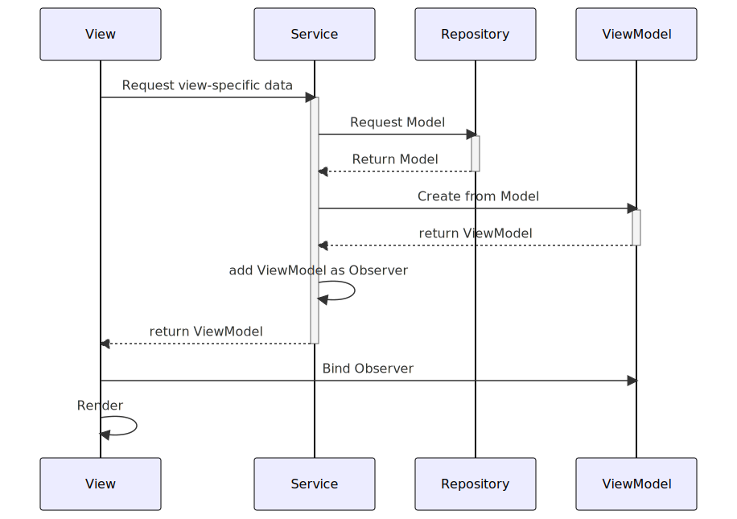

# Overview

The sotravel application is designed to aid the startup
[sotravel.me](https://sotravel.me) manage their trips.

## Context

Sotravel.me organises group adventure travel for young adults. The aim of the
startup is to allow young adults to go on adventurous trips such as skiing or
diving and make friends in the process. The company has a ski trip slated for
April 2023. The goal of the application is to allow trip hosts to publish events
within the trip and invite participants to these within-trip events, track the
physical location of participants, and allow trip hosts and participants to
communicate with each other.

# Features and Specifications

## Host features

-   Log in/Register with Telegram
-   View all traveller locations on a map (in real-time)
-   Send app-wide notifications to all users

## Traveller features

### General

-   Log in/register with Telegram
-   View all nearby traveller locations on a map (in real-time)
-   Add friend on the app
-   People on the same sotravel trip will automatically be friends
-   Create and send out event to people nearby, friends only or selected people
-   RSVP to events via telegram or on the app
-   User profile page that can be edited

### Ski Specific

-   View the ski lifts and routes around the area (colour coded by difficulty)
-   Map to take into account elevation
-   Bonus: User can select a desired destination and map can tell the user how
    to get to destination

### Map

-   Depending on where the user is at, load the correct map. Mountain map vs
    street map.

### In-app instant messaging

-   Provides an easy means of communication between group members
-   Helps to ensure a degree of privacy as users do not need to share more
    personal information like Telegram handle or phone number

# User Manual

Please see [User Manual](./User%20Manual.md)

# Designs

We will break down the applications design into 2 parts, the backend and
frontend. For ease of understanding, the backend specifically refers to the part
of the codebase that does not directly deal with the views. This can be thought
of as the components that do not directly deal with the views. The frontend is
the set of components that do deal with the views (and presentation more
broadly).

## Overall architecture


_See a higher resolution version of the image [here](./diagrams/final-report/overall-architecture.svg)_

The overall architecture can be seen above. We can categorise the system into
the following components

-   Repository and API models
-   Models
-   Service and ViewModels
-   Views

The respositories handle retrieving/updating information from the data store. In
our case, the repositories communicate with Firebase as well as a backend REST
API written in NodeJS.

The Models are the internal representation of key information within the trip.
The API models (which are representations of data from the data source) are
converted into models which are used as the source of truth for the Service
layer and the front end.

The Service layer consumes the models and publishes ViewModels which contain
view-specific information. The ViewModels contain only the information required
for a specific View. Thus, they prevent irrelevant information from being leaked
to the View.

The Views consume the ViewModels and set up an observer relationship with them.
This allows the views to be updated when a ViewModel is updated, without
repeatedly setting the values of UI elements such as text boxes. In effect, this
allows for a 1-way binding relationship.

### Flow of data

The backend of the application adopts a 3 layer architecture approach. A generic
model of how the backend obtains data is shown below



The high level idea is as follows:

-   A repository for each data model exists to retrieve information from a data
    access layer. The repository conforms to an interface so that it can easily
    be swapped out later in favour of a repository that pulls information from a
    different data source.

    -   The diagram below shows how a repository gets data from a REST API
        
-   A service exists for that data model. It contains a dependency-injected
    repository. The service converts the model into a view model which the view
    can consume
-   A view contains a reference to a service which generates a view model. The
    view observes the viewmodel to reflect changes to the data.
    

The 3 layers put together show how data is called from each layer


The `Repositories` for each model conform to an interface and are dependency
injected into each `Service`. Dependency injection is done through property
wrappers. This allows for the following benefits:

-   Repository implementation can easily be changed. Today we suffix many of the
    concrete implementations with "Node" since our data source is essentially a
    Node API, but in the future the data source may change
-   Dependencies are not injected through constructors, preventing a "carrying"
    effect where each layer needs to pass dependencies down
-   Testability is greatly increased as dependencies can easily be replaced with
    stubs/mocks. We already use such stubs/mocks of repositories such as the
    `UserRepository` to provide mock data during testing.

### Frontend

The frontend is relatively straightforward, following an MVVM architecture. A
`Service` is injected into each `View`, and the `View` observes a `ViewModel`
returned by a `Service`. When the service is requested to provide new
information, it obtains the information required and notifies the ViewModels
observing it that there has been a change. The ViewModels then update
themselves and these changes propagate to the View since the View is observing
the ViewModel. Greater detail on how the Observers are set up can be found below
under the section
[Service-ViewModel observer relationship](#service-viewmodel-observer-relationship)

## Models

The application has 5 key models it makes use of. They are defined below.


These models are enough to ensure that all the key data for the application can
be derived.

## Repositories

The application makes use of 5 repositories. These repositories primarily
perform CRUD operations on their respective models, and persist those changes to
their respective persistent storage services (Firebase or REST API.)

All of them except `MapRepository` produce the models seen above.
`MapRepository` listens for user coordinates and produces use of built-in
datatype `CLLocation` instead. As a result, to avoid bloat, an encapsulating
model does not exist for the information produced by the `MapRepository`.

### Pull Repositories

`UserRepository`, `TripRepository` and `EventRepository` pull
information from a server when requested. In other words, they operate on a
polling/pull basis.


### Push Repositories

On the other hand, `ChatRepository` and `MapRepository`
operate on a push basis, with information pushed to them from the real-time data
store. To register changes in the data, they take in delegates to update their
respective callers when there is a change in data.

These delegates are termed as `completion` handlers, and are passed in to the
respective repository functions that listen for changes in data on the
database's side.


### Data conversion

The repositories work in terms of `APIModels`, which are Swift classes that
represent the JSON response returned by the server. However, the application
itself fundamentally works in terms of `Model`s which mirror the data consumed
by the application. Thus, the repositories needed essentially perform the
following tasks:

1. Retrieve relevant data as JSON string from server
1. Decode JSON string into API Model type
1. Handle JSON decoding errors if any
1. Convert API Model Type into Model type
1. Return Model to caller

In particular, steps 2-5 were repetitive steps that every respository method
needed to implement. Writing the same code to perform these tasks resulted in a
lot of code reuse. Thus a generic `DecoderHelper` was created that made use of
Swift's [associated
types](https://docs.swift.org/swift-book/documentation/the-swift-programming-language/generics/#Associated-Types)
and type inference to convert `APIModels` into `Models`

We linked the `APIModels` and `Models` through protocols
`ConvertableFromApiModel` and `ApiModel`. The `ConvertableFromApiModel` protocol
specified a constructor that would allow the `Model` to be initialised from an
`ApiModel`.

The relationship between these protocols and classes can be seen below:


One major benefit of using associated types here is that it allows the `Model`'s
constructor to specify which specific sub-type of `ApiModel` it is able to
convert. This improves type safety within the application and prevents issues
such as a User model trying to be initialised from an Event API model.

The code snippet that handles this conversion can be found in the file
[DecoderHelper.swift](https://github.com/DrWala/sotravel-ios-app/blob/main/Sotravel/Sotravel/NodeRepository/DecoderHelper.swift).
It has been replicated below as well:

```swift
static func decodeToClass<ReturnType: ConvertableFromApiModel>(data: String, location: String = #function, line: Int = #line) throws -> ReturnType {
        do {
            let responseModel = try JSONDecoder().decode(ReturnType.TypeToConvertFrom.self, from: Data(data.utf8))
            return try ReturnType(apiModel: responseModel)
        } catch is DecodingError {
            let modelName = String(describing: ReturnType.self)
            let prefix = constructErrorPrefix(location: location, line: line)
            throw SotravelError.message(
                "\(prefix) Unable to decode json at \(location) to \(modelName). The JSON string is \(data)")
        } catch {
            throw error
        }
    }
```

A similar snippet exists to decode into lists instead of singular types as well.

## Services

There are 7 main services used in the application:

-   UserService
-   EventService
-   TripService
-   FriendService
-   ChatService
-   MapService
-   LocationManagerService

Most services interact with their respective repositories for data storage
purposes (e.g `UserService` interacts with `UserRepository`). However, there are
2 main excpetions:

-   `LocationManagerService` interacts with the built-in `CLLocationManager`
    which interfaces with the device's GPS module
-   For better coherence, `FriendService` interacts primarily with
    `TripRepository` to return the users who are going on a specific trip

Each of the services can be seen below, alongside the Repositories they hold a
reference to

_See a higher resolution version of this image
[here](./diagrams/final-report/services-overview.svg)_

Of the 6 services, `UserService`, `EventService`, `TripService` and
`FriendService` are observed by the `ViewModels` they serve. Since these
services create the `ViewModel`s, they register the `ViewModel`s as observers
which are notified when the underlying `Model`(s) change. We explain this in
detail in the section
[Service-ViewModel observer
relationship](#service-viewmodel-observer-relationship)

In addition, the same 4 Services also work with models that may regularly need
to be retrieved but that information does not necessarily need to be up to date.
To reduce the frequency of calls to the backend, they subclass the
`BaseCacheService` class and ensure that data retrieval is attempted from a
local cache first. This has improved the speed of the application, resulting in
a better UX. We explain this in detail in the [caching](#caching) section.

### Service-ViewModel observer relationship

To decouple the `Service` from the `ViewModel`s it serves, an observer pattern
was set up so that the `ViewModel` can observe the `Service` from whom it pulls
data. This ensures that

-   `Services` don't hold direct references to the `ViewModel`s who rely on it,
    decoupling them through the observer abstraction
-   The responsibility of updating the `ViewModel` is passed back to the ViewModel,
    instead of the `Service`

The pattern is set up as shown below:


The observer pattern allows for the `Service` to inform its observers (typically
other `ViewModels`) through the `notifyAll` method that it's relevant data has
changed. Since the `Service` can then call the Observer's `updateFrom` method,
the observers can then perform an update within themselves with the new data
recieved.

Notice that the `Observer` and `Subject` class make use of the [Swift Associated
Types](https://docs.swift.org/swift-book/documentation/the-swift-programming-language/generics/#Associated-Types)
feature to ensure the protocol is kept generic. This means that any Service
implementing the `Subject` protocol can dictate the type of the data being
observed, as well as the type of Observer. This allows for complex observer
relationships to be set up where the type of the data being observed does not
necessarily need to match the class implementing the observer pattern.

The `Service`s which have the Observer protocol implemented are the following:

-   UserService
-   EventService
-   TripService
-   FriendService

The association between these `Service`s and the `ViewModel`s which rely on them
can be seen in the two diagrams below

The first diagram shows which `Service`s implement the Subject protocol:


The next diagram shows which `ViewModel`s implement the Observer protocol:


_Note: Methods have been ommitted for simplicity_

#### Sample interaction: User Service

The diagram below shows an example of how the observer pattern is set
up within the `UserService`. The associated types within the protocols have been
resolved to concrete types to aid the understanding of the diagram.


To see a sample of how the User Service is set up, please proceed to [sample
interactions](#sample-interaction-user-service)

#### Updating data

We've provided a diagram showing how the `ViewModel` is registered as an
observer of the service under [flow of data](#flow-of-data). However, when a
model is updated by the service, the observer pattern allows the `ViewModel`s to
be notified of a change without a new `ViewModel` being instantiated. This is
because the observer pattern allows the `Service` to directly notify observing
`ViewModels` that the associated underlying model has changed. We demonstrate
how that interaction works in the diagram below:


### Caching

We've implemented a custom caching layer that allows for data to be cached and
retrieved without a network call. Specifically, we cache the `Model`s associated
with `UserService`, `EventService`, `TripService` and `FriendService`. The
models associated with these services do not change frequently or in real time,
and thus it is acceptable to cache their values. A `reload` function also
exists in each of these services to pull fresh data from the server should it be
required.

A class diagram showing which classes implement the `BaseCacheService` can be
seen below:


In general, the workflow for working the Cache layer is as follows:


One of the key benefits of introducing the cache at the `Service` layer is the
following: Multiple `ViewModel`s rely on the same model, and thus if we cache
the model, we avoid unnecessary network IO to produce those `ViewModel`s

A class was used instead of a protocol because the `BaseCacheService` was set up
as a generic class with default implementations of all the methods within the
class. This allows the the `BaseCacheService` to easily be subclassed and
provide extensive caching functionality to any class that extends from it.

## Live location sharing

The live location sharing is one of the key features of the application. The
goal is to allow the user to update their location and save that to the
database, as well as allow the user to view the live locations of all of their
friends.

### Location Management: Key responsibilities

The location management functionality has three key parts:

1. Getting the user's current location via GPS
1. Persisting the user's location to the real-time database
1. Pulling all the friends' locations onto the map

Part (1) is handled by the `LocationManager` while parts (2) and (3) are handled
by the `MapStorageService` which relies on the `MapRepository`.

The class diagram for how these 3 key classes interact with the `MapView` is
shown below:


### Location Management: Flow of data

The `LocationManager` resolves the user's current location via GPS, while the
`MapStorageService` sends and receives information from the persistent data
store. The delegate pattern is employed here, where the `MapStorageService`
passes a delegate function to the `LocationManager` to call to when the user's
location is updated. This allows the app to easily swap out the desired
behaviour when the user's location changes, decoupling it from the GPS service
itself as well as allowing flexibility on the actions to be taken when the user
is moving around.

The flow of how the user's GPS coordinates are stored in the data storage as
well as how friends' locations are retrieved and updated on the map can be seen
below:


## Sample Interactions

### Structure of User Service and Observer

This section aims to explain how the UserService is structured with respect to
the Observer protocol. The diagram below shows an example of how the observer
pattern is set up within the `UserService`. The associated types within the
protocols have been resolved to concrete types to aid the understanding of the
diagram.


Since the `UserService` and the `ViewModels` that rely on it
(`ProfileHeaderViewModel`, `EditProfileViewModel`, `SocialMediaLinksViewModel`)
are not directly linked (rather, they are linked through the
`Observer`-`Subject`) relationship, it is easy to scale and add more ViewModels
that rely on the `UserService`. A new ViewModel can easily be created, subclass
the `UserObserver` class, and register itself with the `UserService` to be
notified when a model changes.

### Get User Profile

This section aims to explain how the `ProfileHeaderViewModel` is populated.

The `ProfileHeaderViewModel` is derived from the `User` model. It gets its
information from the `UserService` and `UserRepository` classes. The interaction
between them can be seen below.


The following diagram aims to illustrate how the `ProfileHeaderViewModel` would
be populated when it is first called. It shows the full lifeline onf the
information being retrieved and the how the Observer relationship is set up, as
well as how the cache is used as a first attempt to get the User.


Notice how the cache and observer protocol come together here. The `UserService`
first attempts to retrieve the requested `ProfileHeaderViewModel` from the set
of Observers. If it does not exist, it then proceeds to consruct the
`ProfileHeaderViewModel`. The `User` model is first attempted to be retrieved from
the cache. Should it fail, it then proceeds to get the `User` from the
repository. Following that, it constructs the `ProfileHeaderViewModel`, and sets
it up as an observer to the `UserService`. This ensures that when the underlying
`User` changes, `ProfileHeaderViewModel` can easuly update too.

### Get Chat Page Cell

We present another concrete implementation for how this works in the case of the
Get Chat Page Cell flow:


Another concrete example can be seen with the Chat views:


## Error handling

### Backend

The app defines a custom `SotravelError` class which is thrown at all layers. If
exceptions caught are from other function calls (e.g. decoding JSON throws a
`DecoderError`) the enforced convention is to wrap the error within a
`SotravelError` and throw that instead. There are custom types defined such as
`NetworkError` and `AuthroizationError`, with more to be added as more
development takes place.

The key benefit of this is that errors being bubbled up will only be of one
specific type, with a finite set of reasons. This will make it easier to design
an error handler at the presentation layer that only needs to know of a single
(or a few) fixed error types.

Ideally, we hope to ensure that there is an exception handler that automatically
triggers when errors are bubbled to the view layer.

### Frontend

## Design Patterns Utilised

### Observer pattern

#### Tradeoff: Where's the middle man?

### Delegate pattern

### Repository pattern

### Adapter pattern

### Mediator pattern

### Notes from elsewhere:

The repository acts as an
[Adapter](https://refactoring.guru/design-patterns/adapter) in its conversion
from the API model in the database to the model used in the application. Thus,
the repository helps the application and the data store collaborate with each
other. The repository also acts as a
[Facade](https://refactoring.guru/design-patterns/facade) to the database by
only exposing a few of the API methods required, as well as a
[Proxy](https://refactoring.guru/design-patterns/proxy) through the repository
interface.

# Reflection

# Tests

Please see [Tests](./tests.md)
