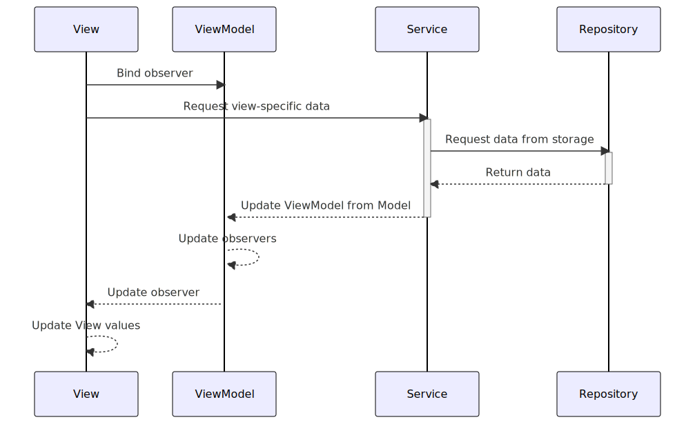
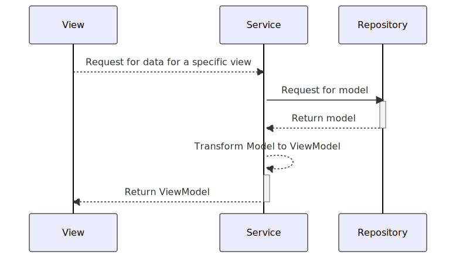
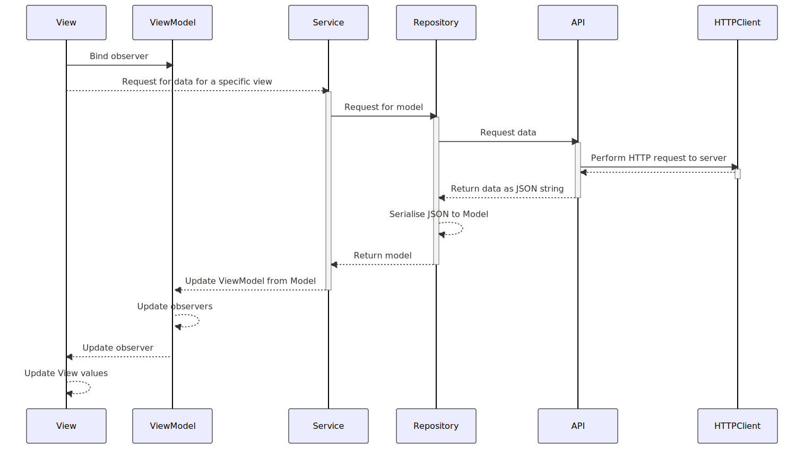

# Overview

The sotravel application is designed to aid the startup
[sotravel.me](https://sotravel.me) manage their trips.

## Context

Sotravel.me organises group adventure travel for young adults. The aim of the
startup is to allow young adults to go on adventurous trips such as skiing or
diving and make friends in the process. The company has a ski trip slated for
April 2023. The goal of the application is to allow trip hosts to publish events
within the trip and invite participants to these within-trip events, track the
physical location of participants, and allow trip hosts and participants to
communicate with each other.

# Features and Specifications

## Host features

-   Log in/Register with Telegram
-   View all traveller locations on a map (in real-time)
-   Send app-wide notifications to all users

## Traveller features

### General

-   Log in/register with Telegram
-   View all nearby traveller locations on a map (in real-time)
-   Add friend on the app
-   People on the same sotravel trip will automatically be friends
-   Create and send out event to people nearby, friends only or selected people
-   RSVP to events via telegram or on the app
-   User profile page that can be edited

### Ski Specific

-   View the ski lifts and routes around the area (colour coded by difficulty)
-   Map to take into account elevation
-   Bonus: User can select a desired destination and map can tell the user how
    to get to destination

### Map

-   Depending on where the user is at, load the correct map. Mountain map vs
    street map.

### In-app instant messaging

-   Provides an easy means of communication between group members
-   Helps to ensure a degree of privacy as users do not need to share more
    personal information like Telegram handle or phone number

# User Manual

Please see [User Manual](./User%20Manual.md)

# Designs

We will break down the applications design into 2 parts, the backend and
frontend. For ease of understanding, the backend specifically refers to the part
of the codebase that does not directly deal with the views. This can be thought
of as the components that do not directly deal with the views. The frontend is
the set of components that do deal with the views (and presentation more
broadly).

## Overall architecture

_See a higher resolution version of the image [here](./diagrams/final-report/overall-architecture.svg)_

The overall architecture can be seen above. We can categorise the system into
the following components

-   Repository and API models
-   Models
-   Service and ViewModels
-   Views

The respositories handle retrieving/updating information from the data store. In
our case, the repositories communicate with Firebase as well as a backend REST
API written in NodeJS.

The Models are the internal representation of key information within the trip.
The API models (which are representations of data from the data source) are
converted into models which are used as the source of truth for the Service
layer and the front end.

The Service layer consumes the models and publishes ViewModels which contain
view-specific information. The ViewModels contain only the information required
for a specific View. Thus, they prevent irrelevant information from being leaked
to the View.

The Views consume the ViewModels and set up an observer relationship with them.
This allows the views to be updated when a ViewModel is updated, without
repeatedly setting the values of UI elements such as text boxes. In effect, this
allows for a 1-way binding relationship.

### Flow of data

The backend of the application adopts a 3 layer architecture approach. A generic
model of how the backend obtains data is shown below

The high level idea is as follows:

-   A repository for each data model exists to retrieve information from a data
    access layer. The repository conforms to an interface so that it can easily
    be swapped out later in favour of a repository that pulls information from a
    different data source.

    -   The diagram below shows how a repository gets data from a REST API
        
-   A service exists for that data model. It contains a dependency-injected
    repository. The service converts the model into a view model which the view
    can consume
-   A view contains a reference to a service which generates a view model. The
    view observes the viewmodel to reflect changes to the data.
    

The 3 layers put together show how data is called from each layer

The `Repositories` for each model conform to an interface and are dependency
injected into each `Service`. Dependency injection is done through property
wrappers. This allows for the following benefits:

-   Repository implementation can easily be changed. Today we suffix many of the
    concrete implementations with "Node" since our data source is essentially a
    Node API, but in the future the data source may change
-   Dependencies are not injected through constructors, preventing a "carrying"
    effect where each layer needs to pass dependencies down
-   Testability is greatly increased as dependencies can easily be replaced with
    stubs/mocks. We already use such stubs/mocks of repositories such as the
    `UserRepository` to provide mock data during testing.

We present another concrete implementation for how this works in the case of the
Get Chat Page Cell flow:

Here, we see how the repository acts as an
[Adapter](https://refactoring.guru/design-patterns/adapter) in its conversion
from the API model in the database to the model used in the application. Thus,
the repository helps the application and the database collaborate with each
other. The repository also acts as a
[Facade](https://refactoring.guru/design-patterns/facade) to the database by
only exposing a few of the API methods required, as well as a
[Proxy](https://refactoring.guru/design-patterns/proxy) through the repository
interface.

### Frontend

The frontend is relatively straightforward, following an MVVM architecture. A
service is injected into each view, and the view observes a view model in the
service that it cares about. As and when the service updates a view model
(usually through a method call to the service) the view will propagate the
updated information.

A concrete example of how this works for the `User` model can be seen below:

Notice how both the service and the repository act as
[Mediators](https://refactoring.guru/design-patterns/mediator) to the viewmodel
and the model respectively. The view collaborates with the viewmodel via the
service, and the service collaborates with the model (to get the viewmodel) via
the repository.

## Models

The application has 5 key models it makes use of. They are defined below.

These models are enough to ensure that all the key data for the application can
be derived.

## Repositories

The application makes use of 5 repositories. These repositories primarily
perform CRUD operations on their respective models, and persist those changes to
their respective persistent storage services (Firebase or REST API.)

All of them except `MapRepository` produce the models seen above.
`MapRepository` listens for user coordinates and produces use of built-in
datatype `CLLocation` instead. As a result, to avoid bloat, an encapsulating
model does not exist for the information produced by the `MapRepository`.

### Pull Repositories

`UserRepository`, `TripRepository` and `EventRepository` pull
information from a server when requested. In other words, they operate on a
polling/pull basis.

### Push Repositories

On the other hand, `ChatRepository` and `MapRepository`
operate on a push basis, with information pushed to them from the real-time data
store. To register changes in the data, they take in delegates to update their
respective callers when there is a change in data.

These delegates are termed as `completion` handlers, and are passed in to the
respective repository functions that listen for changes in data on the
database's side.

## Live location sharing

The live location sharing is one of the key features of the application. The
goal is to allow the user to update their location and save that to the
database, as well as allow the user to view the live locations of all of their
friends.

### Location Management: Key responsibilities

The location management functionality has three key parts:

1. Getting the user's current location via GPS
1. Persisting the user's location to the real-time database
1. Pulling all the friends' locations onto the map

Part (1) is handled by the `LocationManager` while parts (2) and (3) are handled
by the `MapStorageService` which relies on the `MapRepository`.

The class diagram for how these 3 key classes interact with the `MapView` is
shown below:

### Location Management: Flow of data

The `LocationManager` resolves the user's current location via GPS, while the
`MapStorageService` sends and receives information from the persistent data
store. The delegate pattern is employed here, where the `MapStorageService`
passes a delegate function to the `LocationManager` to call to when the user's
location is updated. This allows the app to easily swap out the desired
behaviour when the user's location changes, decoupling it from the GPS service
itself as well as allowing flexibility on the actions to be taken when the user
is moving around.

The flow of how the user's GPS coordinates are stored in the data storage as
well as how friends' locations are retrieved and updated on the map can be seen
below:

### Error handling

The app defines a custom `SotravelError` class which is thrown at all layers. If
exceptions caught are from other function calls (e.g. decoding JSON throws a
`DecoderError`) the enforced convention is to wrap the error within a
`SotravelError` and throw that instead. There are custom types defined such as
`NetworkError` and `AuthroizationError`, with more to be added as more
development takes place.

The key benefit of this is that errors being bubbled up will only be of one
specific type, with a finite set of reasons. This will make it easier to design
an error handler at the presentation layer that only needs to know of a single
(or a few) fixed error types.

Ideally, we hope to ensure that there is an exception handler that automatically
triggers when errors are bubbled to the view layer.

# Reflection

## Evaluation

### What's done so far

-   The app is (more or less) fully functional. We are bugfixing at the moment
-   All interactions conform to the 3 tier architecture that we designed

### What's next

-   More bugfixing
-   End to end testing

## Known Bugs and Limitations

-   There are some bugs in interacting with the backend api that occasionally
    pop up. We are doing tests to resolve these issues.

# Tests

Please see [Tests](./tests.md)
