# Overview

The sotravel application is designed to aid the startup
[sotravel.me](https://sotravel.me) manage their trips.

## Context

Sotravel.me organises group adventure travel for young adults. The aim of the
startup is to allow young adults to go on adventurous trips such as skiing or
diving and make friends in the process. The company has a ski trip slated for
April 2023. The goal of the application is to allow trip hosts to publish events
within the trip and invite participants to these within-trip events, track the
physical location of participants, and allow trip hosts and participants to
communicate with each other.

# Features and Specifications

## Host features

-   Log in/Register with Telegram
-   View all traveller locations on a map (in real-time)
-   Send app-wide notifications to all users

## Traveller features

### General

-   Log in/register with Telegram
-   View all nearby traveller locations on a map (in real-time)
-   Add friend on the app
-   People on the same sotravel trip will automatically be friends
-   Create and send out event to people nearby, friends only or selected people
-   RSVP to events via telegram or on the app
-   User profile page that can be edited

### Ski Specific

-   View the ski lifts and routes around the area (colour coded by difficulty)
-   Map to take into account elevation
-   Bonus: User can select a desired destination and map can tell the user how
    to get to destination

## Map

-   Depending on where the user is at, load the correct map. Mountain map vs
    street map.

# In-app instant messaging

-   Provides an easy means of communication between group members or from user
    to user
-   Helps to ensure a degree of privacy as users do not need to share more
    personal information like Telegram handle or phone number

# User Manual

Please see [User Manual](./User%20Manual.md)

# Designs

We will break down the applications design into 2 parts, the backend and
frontend. For ease of understanding, the backend specifically refers to the part
of the codebase that does not directly deal with the views. This can be thought
of as the components that do not directly deal with the views. The frontend is
the set of components that do deal with the views (and presentation more
broadly)

## Backend

The backend of the application adopts a 3 layer architecture approach. A generic
model of how the backend works is shown below 

The high level idea is as follows:

-   A repository for each data model exists to retrieve information from a data
    access layer. 
-   A service exists for that data model. It contains a dependency-injected
    repository. The service converts the model into a view model which the view
    can consume 
-   A view contains a reference to a service which generates a view model. The
    view observes the viewmodel to reflect changes to the data.
    

The 3 layers put together show how each layer contains a reference to it's
supporting layer.

We observe that each layer deals in terms of interfaces. The constructors for
the service layer take in interfaces to repositories. The services are injected
directly into views, and configured as globally accessible objects on startup.
The main benefit of this approach is:

-   Each implementation can easily be changed. Today we suffix many of the
    concrete implementations with "Node" since our data source is essentially a
    Node API, but in the future the data source may change
-   Each layer's dependencies are injected into the constructors itself. This
    ensures that propagating concrete type changes is very straightforward,
    changes only need to be made in one (or a few) places. Since we are able to
    inject key services during the app's startup, ideally we only need to make
    changes in one location
-   Testability is greatly increased as dependencies can easily be replaced with
    stubs/mocks. We already use such stubs/mocks while waiting for services to
    be wired up

A concrete example of how this works for the `User` model can be seen below:

### Frontend

The frontend is relatively straightforward, following an MVVM architecture. A
service is injected into each view, and the view observes a view model in the
service that it cares about. As and when the service updates a view model
(usually through a method call to the service) the view will propagate the
updated information.

### Error handling

The app defines a custom `SotravelError` class which is thrown at all layers. If
exceptions caught are from other function calls (e.g. decoding JSON throws a
`DecoderError`) the enforced convention is to wrap the error within a
`SotravelError` and throw that instead. There are custom types defined such as
`NetworkError` and `AuthroizationError`, with more to be added as more
development takes place.

The key benefit of this is that errors being bubbled up will only be of one
specific type, with a finite set of reasons. This will make it easier to design
an error handler at the presentation layer that only needs to know of a single
(or a few) fixed error types.

Ideally, we hope to ensure that there is an exception handler that automatically
triggers when errors are bubbled to the view layer.

# Reflection

## Evaluation

### What's done so far

-   All views have been designed
-   General architecture for the application (3 layer, MVVM) has been concretely
    set up
-   Chat flow is setup and connects to realtime database

### What's next

-   Wiring up the frontend to the backend for Events, Invites, Update profile
-   Wiring up authentication to Telegram, Apple Login
-   Refactoring chat to conform better to 3 layer architecture
-   Map POC -> Adding users etc on the map itself

## Lessons

-   More inter-team communication is needed. We ended up working in 2 groups
    (unintentionally) and hope to meet more frequently so everyone's on the same
    page on a regular basis

## Known Bugs and Limitations

-   The app is not complete, so almost nothing "works" yet as most things are
    not wired up.

# Tests

Please see [Tests](./tests.md)
